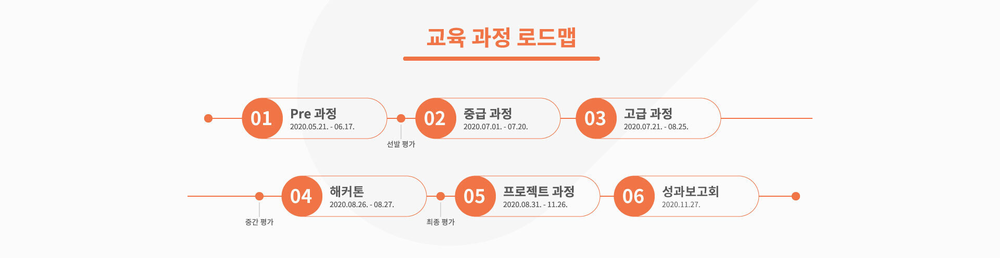

 with 멋쟁이 사자처럼

---
광주 인공지능 사관학교 중고급과정에서 배운 내용을 정리하기 위한 저장소

- 작성자 : 2반 한지호
- 기간 : 2020.07.06 ~ 2020.09.01

## Contents
### 1주차
- 07.06  
  오리엔테이션 / 파이썬 기초 1 / 미니게임 팀 실습
- 07.07  
  파이썬 기초 2 / JSON / Login 팀 실습
- 07.08  
  CLI / Git / VSCode / Login-JSON 실습
- 07.09  
  SQL / DB / Sqlite3 / CSV / Login-CSV 실습 / review 문제 실습
- 07.10  
  Numpy / Pyplot / Pandas / 1주차 복습 / 1주차 시험
### 2주차
- 07.13  
  1주차 시험 해설 / 로테이션 과목별 오리엔테이션  
  웹 소개 / Pandas 기초 / 단층 퍼셉트론 / 자연어 처리 소개 / 알고리즘 소개
- 07.14  
  CLI, Git / Pandas 메소드 / 단층 퍼셉트론  
  정규 표현식 / 데이터 시각화 / 알고리즘 기초 연습문제
- 07.15  
  Git / Pandas 시각화 / abalone 예제 구현 / 정규 표현식 / 머신러닝 개요  
  알고리즘 예제 및 과제 풀이 / 시간 복잡도, 점근 표기법(Big-O)
- 07.16  
  HTML 구조 및 기본 태그 / Pandas 데이터 가공 / abalone 예제 구현  
  토크나이저, 불용어 등 / 머신러닝 학습 과정 / 시간 복잡도, 공간 복잡도
- 07.17  
  2주차 복습 / 엘리스 - 파이썬 프로그래밍 트랙, 프로그래밍 수학
### 3주차
- 07.20  
  HTML 태그 / Pandas 실습 / abalone 예제, 순전파 & 역전파  
  한글 토큰화, 워드 클라우드 / KNN / 공간 복잡도, 스택 (Stack)
- 07.21  
  CSS 기초 / Pandas 실습 / 단층 퍼셉트론 - 이진 판단  
  tf-idf (단어 표현) / 선형 회귀, 경사 하강법 / 큐 (Queue)
- 07.22  
  CSS-Position / 확률 1 / 단층 퍼셉트론 - 이진 판단 / 나이브 베이즈  
  다중 선형 회귀 / 정렬 (Sort)
- 07.23  
  CSS-display / 확률 1-베이즈 정리 / Pulsar 예제 / 나이브 베이즈  
  릿지(Ridge), 라쏘(Lasso) / 스택, 정렬 알고리즘 구현 해설
- 07.24  
  tensorflow 기초 특강 / 3주차 복습 / 3주차 시험 / 자율 학습
### 4주차
- 07.27  
  CSS-flex / 확률 2-이산 확률 / 단층 퍼셉트론 - 선택 분류  
  임베딩-Word2Vec / 다항 회귀, 엘라스틱넷 / 큐 구현 해설, 덱 (Deque)  
- 07.28  
  CSS-flex 실습 / 확률2-이산확률, 연속확률분포 / steel 예제 구현  
  임베딩-Glove / 선형 분류, 로지스틱회귀 / 원형 큐, 덱 연습 문제
- 07.29  
  가상 환경 (pipenv) / 정규분포, 표준화, 분위수, 카이제곱 / 다층 퍼셉트론  
  RNN, LSTM / 로지스틱회귀-규제조절 / 덱-카드 연습 문제, 재귀
- 07.30  
  웹 스크래핑 / 스튜던트 t, F분포 / tensorflow-boston  
  LSTM 실습 / logistic 회귀 / 회전 큐 & 재귀 기본 연습문제
- 07.31  
  머신러닝 (지도 학습) 보강 / 4주차 복습 / 엘리스-프로그래밍 수학
### 5주차
- 08.03  
  뉴스 스크래핑 / 상관계수 / CNN / LSTM-spam 예제 실습  
  Decision Tree / 진법 변환 1 예제 풀이, Greedy 알고리즘
- 08.04  
  영화 리뷰 스크래핑 / 확률분포 연습문제 / CNN 정규화 / spam 예제, CNN  
  Decision Tree / 진법 변환 2 예제 풀이, 동전 예제 풀이
- 08.05  
  개발자 도구-Network, cURL / 통계학 기초 개념 / CNN 정규화-fashion-MNIST  
  CNN, 뉴스 카테고리 / Decision Tree-Titanic / 수열 예제 풀이, 분할 정복법
- 08.06  
  영화 리뷰 스크래핑 / 중심 극한 정리 / CNN 정규화-fashion-MNIST, 사전 학습  
  뉴스 카테고리, 트윗 분류 / Decision Tree, 앙상블 / 회의실 예제 풀이, 이진 탐색
- 08.07  
  ADsP 관련 기본 개념 및 R 기초 특강 / 5주차 복습 / 5주차 시험
### 6주차
- 08.10  
  네이버 쇼핑 스크래핑 / 통계적 추정의 원리 / 사전 훈련-tensorflow hub  
  Seq2Seq / RandomForest / 이진 탐색 예제 풀이, 병합 정렬 (Merge Sort)
- 08.11  
  유튜브 스크래핑 / 통계 1 연습 문제 / 사전 훈련-MobileNet / Seq2Seq  
  Bagging, ExtraTree, GradientBoosting / 병합 정렬 예제 풀이
- 08.12  
  Django 기초 / 데이터 시각화-Seaborn / 전이 학습 / Seq2Seq, Chatbot  
  AdaBoost, XGBoost, LightGBM / 퀵 정렬 (Quick Sort)
- 08.13  
  Django 기초 / 가설검정 기초, 평균 검정 (모집단 하나) / 신경 스타일 전이  
  Seq2Seq, Chatbot, Attention / SVM / 퀵 정렬, 완전 탐색
- 08.14  
  6주차 복습 / 엘리스-문과생을 위한 머신러닝
### 7주차
- 08.18  
  Django-Templates, CSS / 평균 검정 (모집단 둘) / 논문 리뷰 과제 안내  
  Attention 실습 / 교차 검증 / 부분수열의 합 예제 풀이, 연결 리스트
- 08.19  
  Django - models / 범주형 변수와 검정 / 오토인코더 / 콘텐츠 기반 필터링  
  그리드 서치, 오차 행렬 / 요세푸스 예제 풀이, 트리 구조
- 08.20  
  Django - Create, Read / 상관성 분석 / 논문 리뷰 과제 발표  
  협업 필터링 / 모델 평가 / 트리 구조, 트리 순회 예제 풀이
- 08.21  
  개발 관련 직무와 취업 특강 / 7주차 복습 / 엘리스 - 인공지능 & 머신러닝 기초
### 8주차
- 08.24  
  Django - Update, Delete / 분산분석 (ANOVA) / 프로젝트 준비 및 조언  
  추천 시스템 - Surprise 모듈 / 데이터 표현 / 그래프, 깊이 우선 탐색 (DFS)
- 08.25  
  Django - Autentication 1 / 예측분석, 선형회귀 기초 / 생성적 적대 신경망  
  추천 시스템 - Youtube 알고리즘 / 특성 공학 / 너비 우선 탐색 (BFS)
- 08.26  
  Django - DB Relation Auth / 선형회귀 진단 / 생성 모델링과 미래  
  미니 팀 프로젝트 - 영화 추천 / 특성 공학 / VPS 예제, 미로 탐색 예제 풀이
- 08.27  
  Django - DB Relation Auth / 선형회귀 연습 문제 / 강화 학습  
  미니 팀 프로젝트 - 영화 추천 / PCA (주성분 분석) / 동적 계획법
- 08.28  
  Google API, Adobe XD 기초 특강 / 미니 팀 프로젝트 - 영화 추천 
### 9주차
- 08.31  
  Git 협업 기초 / 선형회귀 연습문제 2 / 강화 학습 / 미니 팀 프로젝트 발표  
  비지도학습 - 군집 / 가장 큰 부분합 예제, 동전2 예제 풀이
- 09.01  
  워밍업 프로젝트를 위한 인공지능 서비스 주제 선정 및 팀 빌딩 진행